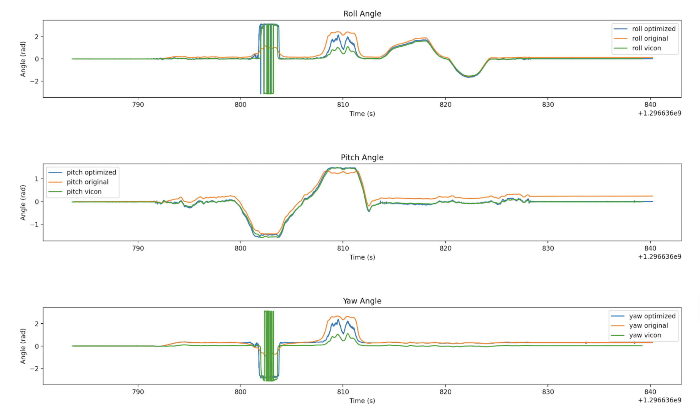
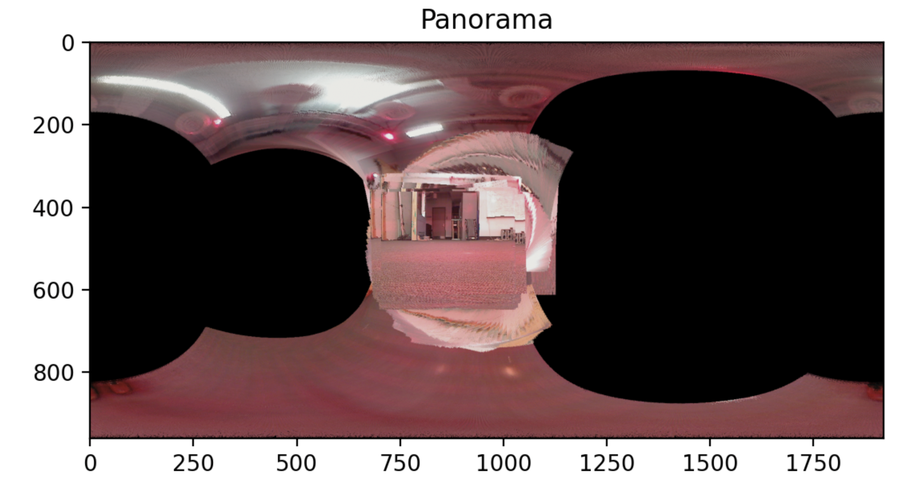
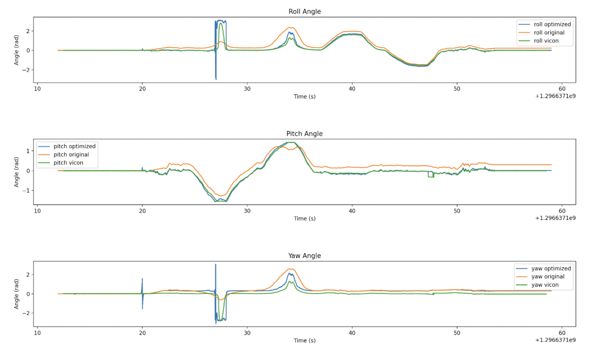
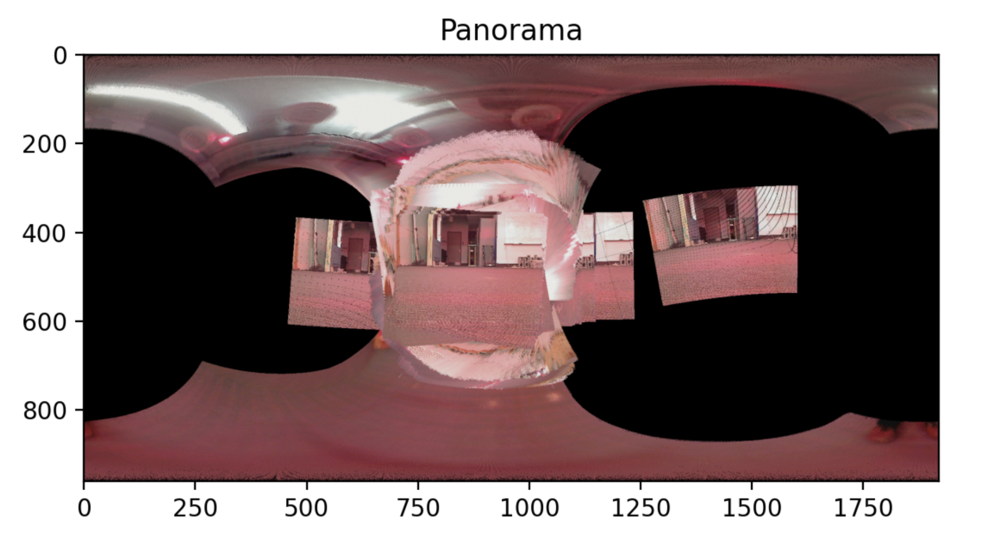
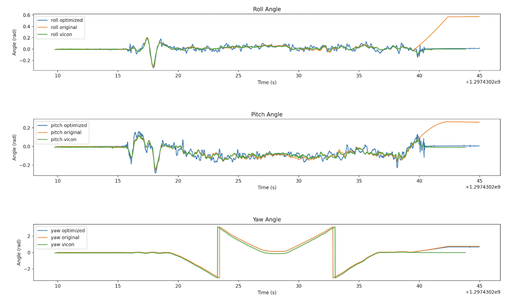
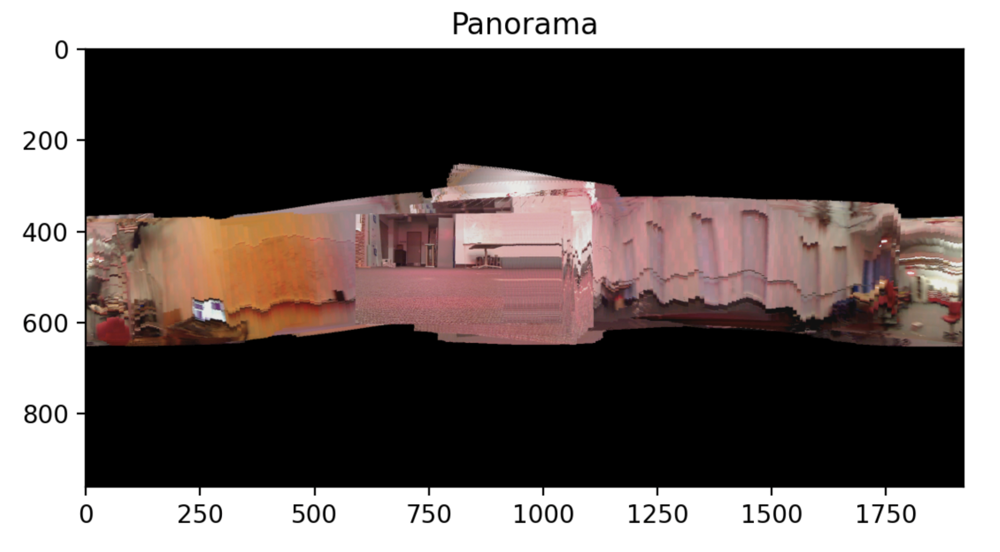
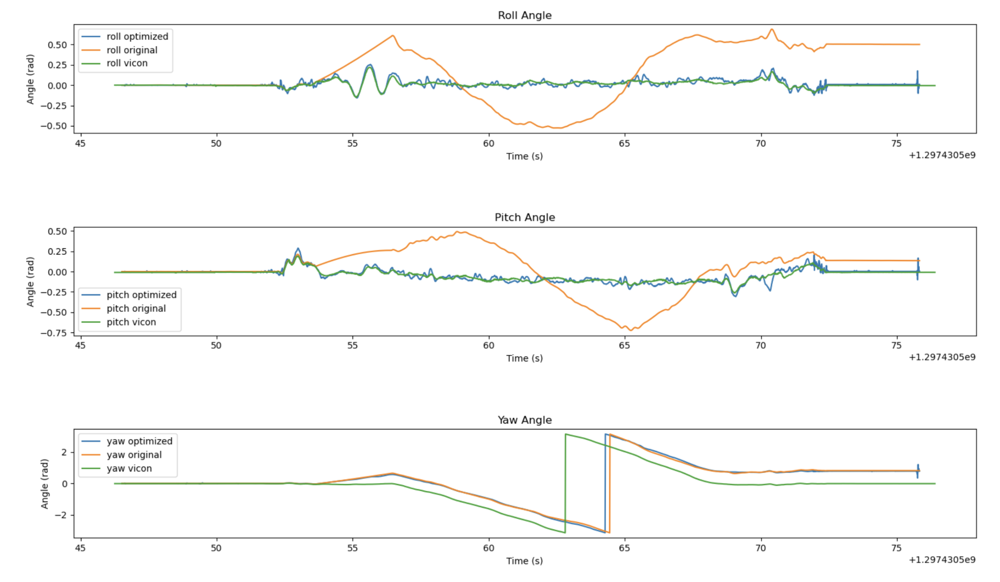
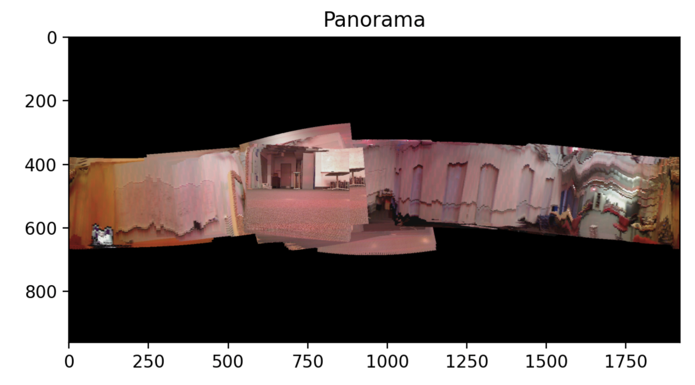
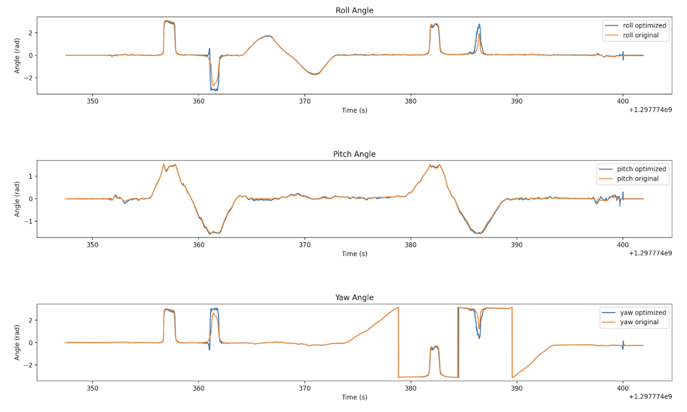

# ECE 276A Project 1 • 3D Orientation Tracking and Panorama Reconstruction

|||
|:--:|:--:|

> **Code is private.** Contact me for access if needed.

## Project snapshot

We estimate a rotating object's 3D orientation from IMU data and use that pose stream to stitch camera frames into a panoramic texture. Applications include robotic self‑localization and scene mapping.

## Key ideas

* **Orientation filter**   Unit quaternions track attitude. A motion model driven by gyro data and an observation model that aligns the gravity vector with accelerometer readings form the basis of an optimization routine.
* **Projected gradient descent**   We refine the orientation trajectory by minimizing a cost that blends motion consistency with sensor agreement while projecting onto the unit three‑sphere after every step.
* **Panorama builder**   Each image pixel is re‑projected onto a sphere, rotated to the world frame, then unwrapped onto a cylinder to form a seamless panorama.

## Mathematical model

*State*  $q_t\in H_*$ is a unit quaternion at time $t$.

*Motion*   $q_{t+1}=q_t\circ \exp\left([0,\tfrac{\tau_t \omega_t}{2}]\right)$ where $\omega_t$ is the measured angular velocity and $\tau_t$ is the sample period.

*Observation*   $a_t=q_t^{-1}\circ[0,0,-g]\circ q_t$ gives expected accelerometer output.

*Cost*

$$
\begin{aligned}
c(q_{1:T}) &= \frac12\sum_{t=0}^{T-1}\bigl\|\log\bigl(q_{t+1}^{-1}\circ f(q_t,\tau_t\omega_t)\bigr)\bigr\|^2 \\
&\quad+\frac12\sum_{t=1}^{T}\|a_t-h(q_t)\|^2
\end{aligned}
$$

Subject to $|q_t|_2=1$ for every $t$.

## Algorithm outline

1. **Calibration**   Convert raw ADC readings to physical units

   ```
   value = (raw − bias) × scale_factor
   scale_factor = V_ref / (1023 × sensitivity)
   ```
2. **Initial guess**   Integrate gyro data naively to seed $q_{1:T}$.
3. **Projected gradient descent**

   * Gradient step: $q_{1:T}^{(k+1)} = q_{1:T}^{(k)} - \alpha\nabla c(q_{1:T}^{(k)})$
   * Projection: $q \gets q/|q|_2$
4. **Panorama generation**

   * Timestamp match camera frames to closest IMU pose.
   * Map each image pixel $(x,y)$ through
     $\phi = \frac{y}{120} \times \tfrac\pi8, \qquad \theta = \frac{x}{160} \times \tfrac\pi6$
     then convert to Cartesian, rotate with $R_{\text{imu→world}},R_{\text{cam→imu}}$, and unwrap onto a cylinder of height $\pi$.
   * Composite frames by simple overwrite for now.

## Results and visuals

Here are some plots of orientation error and the corresponding panorama.

|Orientation error|Panorama|
|:--:|:--:|
|||
|||
|||
|||
|||
